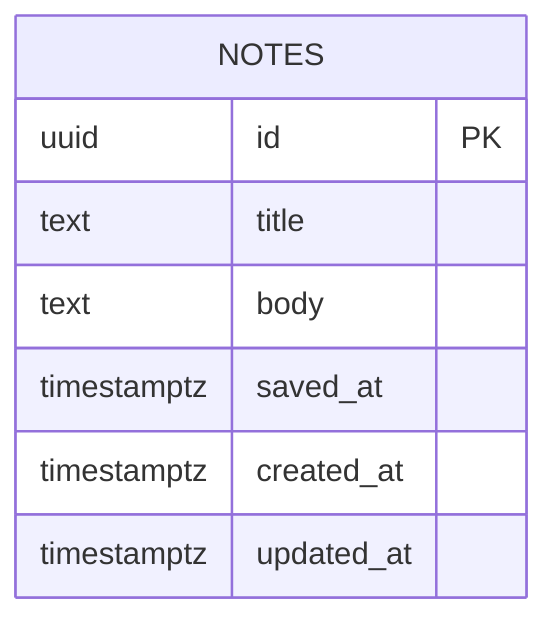

# Database Design (ERD) — Note Board

Engine: PostgreSQL 16
Last updated: 2026-08-13
Source requirements: `docs/general/SRS.md`

## 1. Overview

This schema stores saved notes for the single read-only Notes page. `notes` is the only product entity and aggregate root; visitors, sessions, write workflows, search state, and authentication data are deliberately kept out of the database because they are out of scope.

## 2. Diagram

Cardinality: no relationships exist in current scope.

## 3. Entities

### 3.1 `notes`

**Purpose** — Store saved notes shown in the read-only list. **Traces to** — GENERAL-001.

| Column | Type | Null | Default | Unique | Description |
|---|---|---|---|---|---|
| `id` | `uuid` | no | `gen_random_uuid()` | PK | Surrogate key for one saved note |
| `title` | `text` | no | none | no | Note title displayed as stored |
| `body` | `text` | no | none | no | Note body displayed as stored |
| `saved_at` | `timestamptz` | yes | none | no | Saved timestamp displayed when present |
| `created_at` | `timestamptz` | no | `now()` | no | Row creation timestamp |
| `updated_at` | `timestamptz` | no | `now()` | no | Row update timestamp for imported or maintenance changes |

**Nullable columns** — `saved_at` is nullable because GENERAL-001 explicitly allows stored notes to lack saved timestamp; absence means timestamp is unavailable, not empty.

**Foreign keys**

| Column | References | On delete | On update | Why |
|---|---|---|---|---|
| none | none | n/a | n/a | Current scope has no parent entity |

**Constraints**

| Name | Rule | Why |
|---|---|---|
| `ck_notes_title_not_blank` | `length(btrim(title)) > 0` | Required title must not be blank |
| `ck_notes_body_not_blank` | `length(btrim(body)) > 0` | Required body must not be blank |

**Indexes**

| Name | Columns | Type | Query it serves |
|---|---|---|---|
| `idx_notes_saved_at_id` | `saved_at DESC NULLS LAST, id DESC` | btree | Fetch saved notes list in stable newest-first order |

**Lifecycle** — hard delete only. Product has no delete UI or audit/reporting requirement; if rows are removed by maintenance, they should disappear from read-only list.

## 4. Enumerations

No enumerations. Notes have no status, category, visibility, or workflow state in current SRS.

## 5. Access patterns

| # | Pattern | Frequency | Index used |
|---|---|---|---|
| 1 | `SELECT id, title, body, saved_at FROM notes ORDER BY saved_at DESC NULLS LAST, id DESC` | Every page load | `idx_notes_saved_at_id` |

## 6. Data volume and growth

| Table | Rows at launch | Growth | Retention |
|---|---|---|---|
| `notes` | Existing saved notes; may be zero | Unknown, but current product has no write path | Indefinite until maintenance removes rows |

No table is expected to exceed 10M rows within a year from product scope because product has no note creation feature.

## 7. Integrity, privacy, and security

- Database enforces required `title` and `body`, non-blank content, surrogate primary key, and stable list-order index. Application formats dates and handles unavailable `saved_at` for display.
- Personal data: `title` and `body` may contain user-entered note content from outside this module. Retention is indefinite because current product has no delete requirement.
- Secrets: none.
- Row-level access: none. SRS assumes every visitor may read same notes; if that changes, auth and authorization need new scope and schema review.

## 8. Migrations

| # | Change | Forward | Backward | Safe on non-empty table |
|---|---|---|---|---|
| 1 | Initial notes schema | Create `notes` table with `pgcrypto` extension for `gen_random_uuid()`, columns, checks, and `idx_notes_saved_at_id` | Drop `notes` table and `pgcrypto` extension only if no other object depends on it | Yes for new database; on populated database, creates new table and index without touching existing rows |

Forward migration should use one timestamped pair under `code/backend/migrations/`, for example `YYYYMMDDHHMMSS_create_notes.up.sql` and matching `.down.sql`. Backward migration is destructive for `notes` rows; acceptable only before production data exists or after explicit backup because dropping product data cannot be undone by schema alone.

## 9. Open questions

| Question | Owner | Blocking |
|---|---|---|
| none | PM / stakeholder | no |
