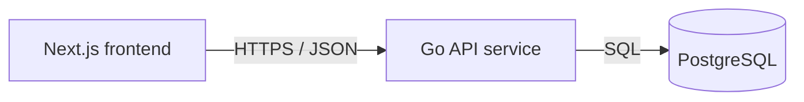

# Service & Interface Design — Note Board

Last updated: 2026-08-13
Source: `docs/general/SRS.md`, `docs/architecture/erd.md`

## 1. Service map



| Service | Responsibility | Owns (tables) | Depends on | Deploy unit |
|---|---|---|---|---|
| Go API service | Serve public read-only notes API and hide database details from browser | `notes` | PostgreSQL | backend container |
| PostgreSQL | Persist saved notes already available to product | none | none | database container |
| Next.js frontend | Render one Notes page and convert API loading, empty, success, and error outcomes into UI states | none | Go API service | frontend container |

**Why these boundaries** — single backend service: no additional service boundary justified yet. Frontend, API, and database remain separate deploy units because browser rendering, HTTP API, and persistence have different runtime concerns; no microservice split exists inside backend.

## 2. Cross-cutting contract

### 2.1 Base

- Base URL: `{scheme}://{host}/api/v1`
- Content type: `application/json; charset=utf-8`
- Versioning: URL path major version. A new major version only for breaking changes.
- Trace header: `X-Request-Id` accepted from caller, generated if absent, echoed on every response and present in every backend log line.
- JSON naming: `snake_case`.
- Timestamp format: RFC 3339 UTC on API wire. Frontend may format dates with browser locale for display.

### 2.2 Authentication and authorization

| Aspect | Decision |
|---|---|
| Mechanism | None. Public read-only endpoint per GENERAL-001 assumption that every visitor may read same notes. |
| Token lifetime | Not applicable. |
| Refresh | Not applicable. |
| Transport | No `Authorization` header required or interpreted. |
| Roles | Visitor only. |
| Enforcement point | Endpoint handler rejects no caller based on identity; future auth requires new scope and contract revision. |

### 2.3 Error contract

Every non-2xx response, from every endpoint, has this shape:

```json
{
  "error": {
    "code": "INTERNAL",
    "message": "Human-readable summary, safe to show a user.",
    "details": [],
    "request_id": "01HX..."
  }
}
```

Consumers branch on `code`. `message` is display text and may be reworded at any time without notice. It is not part of contract.

**Error catalog** — full closed set for this project.

| Code | HTTP | Meaning | Retryable |
|---|---|---|---|
| `VALIDATION_FAILED` | 422 | Query parameter is well-formed JSON/HTTP but violates contract constraints | no |
| `BAD_REQUEST` | 400 | Request is malformed, including wrong query parameter type or malformed cursor | no |
| `RATE_LIMITED` | 429 | Too many requests; honor `Retry-After` | yes |
| `INTERNAL` | 500 | Unexpected failure; details logged, not returned | yes |
| `UNAVAILABLE` | 503 | Database unavailable or service shutting down | yes |

No `UNAUTHENTICATED`, `PERMISSION_DENIED`, `NOT_FOUND`, or `CONFLICT` responses exist in current contract because there is no auth, per-resource access check, single-resource route, or write invariant exposed.

### 2.4 Pagination

Cursor pagination is project-wide scheme because notes list can grow and can be maintained outside product while visitors read it.

```text
GET /api/v1/notes?limit=50&cursor=eyJzYXZlZF9hdCI6IjIwMjYtMDgtMTNUMTA6MDA6MDBaIiwiaWQiOiI..."
```

```json
{
  "notes": [],
  "next_cursor": null,
  "has_more": false
}
```

| Aspect | Decision |
|---|---|
| Style | Cursor |
| Default limit | 50 |
| Max limit | 100 |
| Default sort | `saved_at DESC NULLS LAST, id DESC`; stable because `id` is unique tiebreaker |
| Empty result | `notes: []`, `next_cursor: null`, `has_more: false` |
| Cursor format | Opaque base64url string encoding last row sort keys; clients must not parse it |

### 2.5 Validation boundary

Go API HTTP handler is validation boundary. It validates method, path, query parameter presence, type, range, cursor format, and request size before calling repository/database code. Downstream service and repository code may trust typed inputs and must not re-validate defensively.

### 2.6 Idempotency

No write endpoints exist. No endpoint accepts `Idempotency-Key`. `GET /api/v1/notes` is HTTP-idempotent and has no side effects.

## 3. Endpoints

### 3.1 `GET /api/v1/notes`

**Purpose** — Return saved notes for read-only Notes page. **Traces to** — GENERAL-001. **Auth** — public Visitor; no credentials required.

**Path / query parameters**

| Name | In | Type | Required | Constraints | Description |
|---|---|---|---|---|---|
| `limit` | query | integer | no | 1 through 100 | Maximum notes to return. Defaults to 50. Reject non-integer, zero, negative, or over 100. |
| `cursor` | query | string | no | Opaque cursor previously returned by same endpoint; max 1024 bytes | Starts page after prior result. Reject malformed or expired/unknown shape cursors. |

**Request body**

No request body. Requests with a non-empty body are rejected as `BAD_REQUEST`.

**Success response** — `200`

```json
{
  "notes": [
    {
      "id": "4b931778-6b83-4d22-9a1b-8aa6b9f4e73d",
      "title": "Release checklist",
      "body": "Confirm migrations, API contract, and UI states.",
      "saved_at": "2026-08-13T10:00:00Z"
    }
  ],
  "next_cursor": null,
  "has_more": false
}
```

| Field | Type | Nullable | Description |
|---|---|---|---|
| `notes` | array of note objects | no | Returned notes in newest-saved-first order. Empty array drives frontend empty state. |
| `notes[].id` | string uuid | no | Stable note identifier. |
| `notes[].title` | string | no | Note title displayed as stored. Backend does not trim or rewrite stored value. |
| `notes[].body` | string | no | Note body displayed as stored. Frontend handles long content without horizontal page scroll. |
| `notes[].saved_at` | string timestamp | yes | Saved timestamp when present; `null` when stored value is unavailable. |
| `next_cursor` | string | yes | Cursor for next page; `null` when no next page exists. |
| `has_more` | boolean | no | True when another page exists. |

**Errors** — every code this endpoint can return. No others.

| Code | HTTP | Trigger |
|---|---|---|
| `BAD_REQUEST` | 400 | Non-empty body, malformed cursor, wrong query parameter type, duplicate unsupported query shape, or cursor longer than 1024 bytes |
| `VALIDATION_FAILED` | 422 | `limit` outside 1..100 |
| `RATE_LIMITED` | 429 | Caller exceeds service rate limit; response includes `Retry-After` |
| `INTERNAL` | 500 | Unexpected API failure after request validation |
| `UNAVAILABLE` | 503 | PostgreSQL unavailable, query timeout, migration/draining state, or database connection pool cannot provide connection |

**Notes** — read-only, no side effects, no idempotency key. Ordering guarantee is `saved_at DESC NULLS LAST, id DESC` for all pages. API returns all stored notes visible to every visitor; no search, filter, auth, add, edit, delete, or preview-control contract exists.

## 4. Asynchronous work

No jobs, queues, schedules, or events in current scope.

| Name | Trigger | Payload | Retry | Backoff | Dead letter | Idempotent |
|---|---|---|---|---|---|---|
| none | n/a | n/a | n/a | n/a | n/a | n/a |

## 5. External integrations

No third-party integrations. Only database dependency exists and is internal to deployment.

| System | Purpose | Protocol | Timeout | Retry | On failure | Secrets |
|---|---|---|---|---|---|---|
| PostgreSQL | Read saved notes | SQL over database driver | 2s per notes query, bounded by inbound request timeout | No automatic retry for a failed query in same request; caller may retry whole GET by reloading | API returns `UNAVAILABLE`; frontend shows error state with no partial note list | `DATABASE_URL` in backend environment |

Cross-service calls:

| Caller | Callee | Mode | Timeout | Retry policy | Idempotency key | Failure behavior |
|---|---|---|---|---|---|---|
| Next.js frontend | Go API `GET /api/v1/notes` | synchronous HTTPS/JSON | 5s browser request timeout if implemented client-side; otherwise Next.js fetch timeout must not exceed 5s | No automatic loop retry; visitor may refresh | none; GET is idempotent | Show error state, no note cards |
| Go API | PostgreSQL | synchronous SQL | 2s query timeout | No retry inside request | none; read-only query | Return `UNAVAILABLE` and log with `request_id` |

## 6. Non-functional targets

| Aspect | Target |
|---|---|
| p95 latency (read) | API `GET /api/v1/notes` under 500 ms for first page at launch data size; page initial notes state within 2 seconds excluding outage time |
| p95 latency (write) | Not applicable; no write endpoints |
| Availability | Best-effort single deployment; API reports unhealthy while database unavailable |
| Rate limit | 120 requests per IP per minute for `GET /api/v1/notes` when rate limiting is enabled; otherwise no app-level limit in local dev |
| Payload cap | Request body max 0 bytes for `GET /api/v1/notes`; response should keep `limit` cap at 100 notes |
| Timeout (inbound) | 10s HTTP server timeout; endpoint should finish or fail before 5s |

## 7. Observability

- Every API request log line includes `request_id`, method, path, status, duration_ms, remote_addr or forwarded client IP when trusted, and error_code when non-2xx.
- Metrics per endpoint: request count, status count, duration histogram, database query duration, and database error count.
- Never log secrets, tokens, full note bodies, full request bodies, database connection strings, SQL errors returned to caller, or internal hostnames in API responses.

## 8. Contract evolution

| Change | Additive or breaking | Migration path |
|---|---|---|
| Add optional field to note object | Additive | Frontend ignores unknown fields by default. |
| Add new endpoint under `/api/v1` | Additive | No migration needed. |
| Change note field name, type, sort order, pagination defaults, error code mapping, or auth requirement | Breaking | Add `/api/v2`, migrate frontend, then deprecate old endpoint with `Deprecation` header before removal. |
| Add create, edit, delete, search, filter, or auth | Breaking to product scope, not just API | Requires PM scope update, SRS revision, ERD/service design revision, and new story. |

## 9. Requirements traceability

| SRS requirement | Endpoint(s) | Notes |
|---|---|---|
| GENERAL-001 | `GET /api/v1/notes` | Provides notes data, empty array for empty state, and enumerated errors for error state. Loading state is frontend behavior while request is pending. |

| Endpoint | Requirement(s) |
|---|---|
| `GET /api/v1/notes` | GENERAL-001 |

## 10. Open questions

| Question | Owner | Blocking |
|---|---|---|
| none | PM / stakeholder | no |
